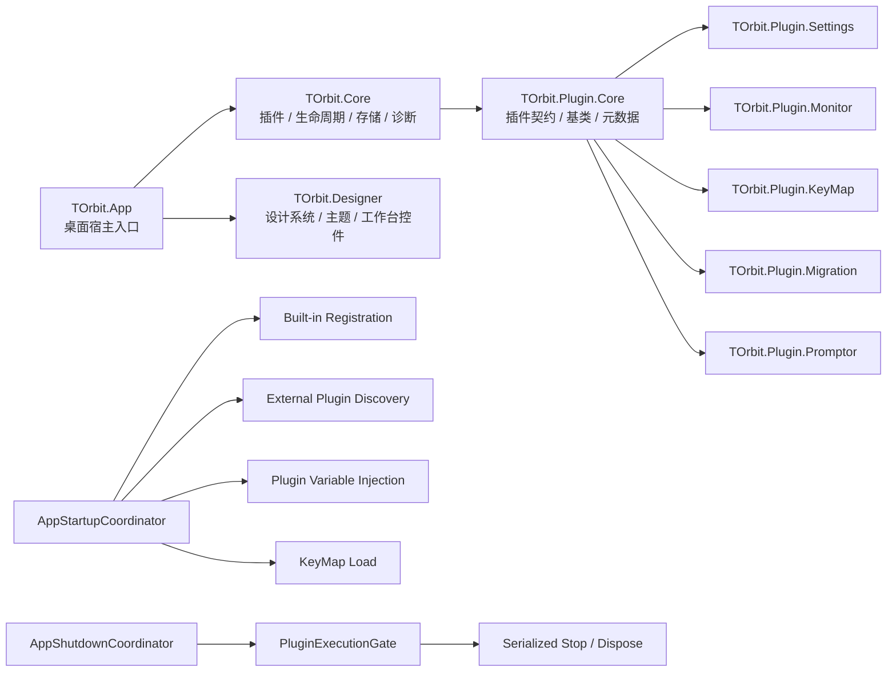

# T-Orbit

<p align="center">
  <strong>基于 .NET 10 与 Avalonia 12 的插件化桌面工具宿主</strong>
</p>

<p align="center">
  为内置工具、目录插件、统一设计系统、变量注入、快捷键系统和诊断链路提供稳定宿主能力。
</p>

<p align="center">
  
  
  
  
  
  
</p>

## 概览

T-Orbit 不是单一业务应用，而是一个可扩展的桌面工具宿主：

- 宿主管理插件发现、加载、生命周期、导航、设置、诊断和持久化。
- 插件提供功能页面、工具能力和业务逻辑。
- 所有插件共享统一设计系统、主题系统、变量管理和宿主工具接口。

## 目录

- [为什么是 T-Orbit](#为什么是-t-orbit)
- [当前能力](#当前能力)
- [内置与示例插件](#内置与示例插件)
- [快速开始](#快速开始)
- [项目结构](#项目结构)
- [架构摘要](#架构摘要)
- [架构图](#架构图)
- [Screenshots / UI Preview](#screenshots--ui-preview)
- [Roadmap / TODO](#roadmap--todo)
- [开发插件](#开发插件)
- [Code Agent Prompt](#code-agent-prompt)
- [测试](#测试)
- [文档](#文档)
- [许可证](#许可证)

## 为什么是 T-Orbit

| 方向 | 当前实现 |
| --- | --- |
| 插件宿主 | 同时支持内置插件和目录插件 |
| 生命周期 | 支持启动、停止、重启，并按插件串行化执行 |
| 启动与关闭 | 通过 `AppStartupCoordinator` 与 `AppShutdownCoordinator` 统一协调 |
| 变量管理 | 支持默认值、加密标记、运行期注入和插件级提醒 |
| 快捷键系统 | 支持注册、覆盖、持久化和运行期刷新 |
| 诊断链路 | 可追踪启动、迁移、插件发现与关闭阶段的问题 |
| 持久化 | 使用 SQLite 保存应用偏好、快捷键和插件变量 |
| UI 框架 | 宿主与插件页共享统一设计系统和工作台式布局框架 |

## 当前能力

### 宿主层

- 插件目录扫描与 Manifest 加载
- 插件目录注册与导航构建
- 统一设置页、监控页、快捷键页
- 应用级诊断收集与展示

### 插件层

- `Visual` 类型插件页面承载
- 插件变量声明、注入、校验状态发布
- 页面头部动作区扩展
- 插件能力标签与元数据展示

### 工程能力

- SQLite 持久化
- `PluginExecutionGate` 生命周期串行化
- 关闭流程与普通生命周期共享门控
- 运行期快捷键刷新

## 内置与示例插件

| 插件 | 说明 |
| --- | --- |
| `torbit.keymap` | 快捷键查看、编辑与覆盖管理 |
| `torbit.settings` | 主题、字体、窗口行为与插件变量管理 |
| `torbit.monitor` | 插件运行状态、能力声明与应用诊断查看 |
| `torbit.migration` | EF Core 迁移插件，支持默认连接串注入和多 Profile 配置 |
| `torbit.promptor` | 提示词优化插件示例 |

## 快速开始

### 环境要求

- `.NET 10 SDK`
- 可运行 Avalonia 桌面应用的图形环境

### 构建

```bash
dotnet build TOrbit.slnx
```

### 运行

```bash
dotnet run --project TOrbit.App/TOrbit.App.csproj
```

### 测试

```bash
dotnet test TOrbit.Core.Tests/TOrbit.Core.Tests.csproj
```

## 项目结构

```text
T-Orbit/
├─ TOrbit.App/                 # 桌面宿主入口、主窗口、导航与启动流程
├─ TOrbit.Core/                # 核心服务：插件、存储、变量、快捷键、诊断
├─ TOrbit.Designer/            # 统一设计系统、主题与复用控件
├─ TOrbit.Plugin.Core/         # 插件契约、基础模型、基类
├─ TOrbit.Plugin.KeyMap/       # 内置插件：快捷键管理
├─ TOrbit.Plugin.Settings/     # 内置插件：设置与变量管理
├─ TOrbit.Plugin.Monitor/      # 内置插件：插件监控与应用诊断
├─ TOrbit.Plugin.Migration/    # 外部插件：EF Core 迁移
├─ TOrbit.Plugin.Promptor/     # 外部插件：提示词优化示例
├─ TOrbit.Core.Tests/          # 核心测试
└─ TOrbit.wiki/                # Wiki 文档
```

## 架构摘要

### 启动

- 主窗口先创建，避免初始化阻塞首帧。
- 启动协调器异步执行：
  - 内置插件注册
  - 外部插件发现与加载
  - 插件变量注入
  - 快捷键覆盖加载

### 生命周期

- `PluginLifecycleService` 负责普通启停与重启。
- `PluginExecutionGate` 为每个插件提供独立串行化门控。
- `AppShutdownCoordinator` 在关闭流程中复用同一套门控，避免和运行中的启停操作冲突。

### 变量与诊断

- 插件通过 `PluginVariableDefinition` 声明变量元数据。
- 设置页保存不会被变量校验阻塞。
- 校验问题会以“插件级提醒”的方式展示在对应插件页头部。
- 启动、迁移、发现、关闭阶段的异常会汇总到应用诊断。

### 存储

- 数据库路径：`%APPDATA%/T-Orbit/t-orbit.db`
- 主要存储：
  - 应用偏好
  - 快捷键绑定
  - 插件变量

## 架构图



## Screenshots / UI Preview

当前仓库尚未内置正式截图资源，下面列出当前 UI 预览重点，便于快速理解页面结构：

| 页面 | 当前风格 |
| --- | --- |
| Main Host | 顶部品牌栏 + 左侧模块导航 + 右侧工作区内容区 |
| Monitor | 运维控制台布局，左侧插件清单，右侧状态与诊断 |
| Settings | 左右工作区布局，左侧宿主设置，右侧插件变量管理 |
| KeyMap | 左侧目录检索，右侧绑定编辑器 |
| Migration | 左侧连接配置，右侧迁移操作与文件查看弹窗 |
| Promptor | 顶部策略控制区 + 左右双编辑工作区 |

后续建议补充：

- 主窗口整体截图
- `Monitor` 页面截图
- `Settings` 页面截图
- `Migration` 与迁移文件弹窗截图

## Roadmap / TODO

### Product

- 补充正式 UI 截图与 README 首页视觉素材
- 继续完善外部插件示例与插件模板
- 为监控页增加更细粒度的诊断筛选与清理能力

### Architecture

- 收窄导航与页面失效范围，减少不必要的整页重建
- 继续抽离只读状态模型，减少 ViewModel 内散落推导
- 为启动阶段补充更明确的预热反馈与阶段状态

### Plugin Experience

- 完善插件变量校验器与更贴近业务的插件页提示
- 强化插件发现失败与兼容性错误的用户可见提示
- 统一插件页面头部动作、状态徽标和空状态表达

### Engineering

- 解决运行中宿主锁定插件产物导致的开发期增量构建问题
- 为外部插件发现、manifest 拷贝和程序集命名补更多回归测试
- 继续扩展 `TOrbit.Core.Tests` 覆盖启动、关闭和插件加载链路

## 开发插件

一个最小可运行的插件通常包括：

1. 元数据类
2. 插件类
3. ViewModel
4. View

基础模式如下：

```csharp
public sealed class MyPlugin : BasePlugin, IVisualPlugin
{
    public override PluginDescriptor Descriptor { get; } =
        CreateDescriptor<MyPlugin>(MyPluginMetadata.Instance);

    public override Control GetMainView()
    {
        EnsureView();
        return _view!;
    }
}
```

## Code Agent Prompt

下面提供两套可直接复制给 Code Agent / AI 编码助手的插件生成提示词模板。

### 模板 A：最小插件

适合场景：

- 新建一个结构简单的工具页
- 只需要单页 UI 和少量命令
- 不依赖复杂变量、日志链路或外部进程

```text
你正在为 T-Orbit 项目创建一个“最小可运行插件”。

目标：
- 按照 T-Orbit 当前架构生成一个简单、可运行、可在导航中出现的插件
- 插件只需要一个主页面、一个 ViewModel 和基础元数据
- 代码必须遵循当前仓库命名、目录结构、契约和 UI 风格

项目约束：
- 宿主为 .NET 10 + Avalonia 12
- 插件基于 TOrbit.Plugin.Core、TOrbit.Designer 和现有插件模式
- Visual 类型插件必须继承 BasePlugin，并实现 IVisualPlugin
- 不要额外创建无必要的 service / helper / manager 抽象
- 文案简洁、产品化，不要出现 AI 模板腔
- UI 遵循当前工作台风格，不要生成传统卡片拼贴式后台页面

必须生成：
1. 插件主类
2. 元数据类
3. ViewModel
4. View
5. plugin.json
6. .csproj

实现要求：
- plugin.json 中的 id、entryAssembly、entryType 必须与代码保持一致
- 如果是外部插件，输出目录指向 TOrbit.App/bin/$(Configuration)/net10.0/plugins/<PluginName>/
- 优先参考现有插件实现方式
- 优先复用 ToolPageLayout、SectionCard、EmptyState、StatusBadge 等已有控件
- 命令优先使用 CommunityToolkit.Mvvm

交付要求：
- 列出新增文件
- 简述插件入口、页面结构和主要命令
- 给出验证方式，例如 dotnet build 和运行后检查导航项是否出现
```

### 模板 B：复杂工具型插件

适合场景：

- 需要左右工作区、编辑器、日志区或状态栏
- 需要插件变量、文件选择、外部进程、本地 IO、网络调用
- 需要更完整的交互流程和页面状态管理

```text
你正在为 T-Orbit 项目创建一个“复杂工具型插件”。

目标：
- 生成一个符合 T-Orbit 当前架构的完整工具插件
- 插件可能包含工作区布局、状态区、日志区、变量注入、文件操作或外部命令调用
- 输出代码必须与当前仓库风格一致，不能引入另一套设计语言或工程习惯

项目约束：
- 宿主是 .NET 10 + Avalonia 12
- 插件基于 TOrbit.Plugin.Core、TOrbit.Designer、CommunityToolkit.Mvvm
- Visual 类型插件应继承 BasePlugin，并实现 IVisualPlugin
- 如果插件需要变量，使用 PluginVariableDefinition + IPluginVariableReceiver
- 如果页面需要左右分栏，优先使用 SplitWorkspace
- 如果页面需要顶部概览或状态区，遵循当前工作台式框架
- 如果需要日志输出，优先复用 LogViewer 或现有日志弹窗模式
- 如果需要编辑器，优先复用 CardTextEditor 或已有编辑器模式
- UI 不要做成传统后台卡片堆砌；每个区块只承担一个职责

必须生成：
1. 插件主类
2. 元数据类
3. ViewModel
4. View
5. plugin.json
6. .csproj
7. 如有必要的模型类
8. 如确实需要的服务类

实现要求：
- 先阅读仓库中最相近的插件，再决定结构
- plugin.json 的 id、entryAssembly、entryType 必须与代码保持一致
- 外部插件必须确保程序集输出到 TOrbit.App/bin/$(Configuration)/net10.0/plugins/<PluginName>/
- 如果需要变量，补充变量定义、默认值和注入逻辑
- 如果涉及文件或进程操作，给出清晰错误处理和状态反馈
- 如果涉及危险操作，界面中应有明确确认或提醒
- 命名直接、清晰，不要引入无关抽象层

交付要求：
- 列出新增和修改的文件
- 说明插件入口、页面分区、主要命令、变量和外部依赖
- 说明为什么采用当前布局和控件
- 给出验证步骤，例如：
  - dotnet build
  - 运行宿主后检查导航项
  - 检查变量注入
  - 检查日志 / 文件 / 命令执行链路
```

### 使用建议

1. 先选择最接近场景的模板。
2. 在模板前面补一句你的目标，例如“请创建一个文件哈希计算插件”或“请创建一个 API 调试工具插件”。
3. 明确是否需要这些能力：
   - 插件变量
   - 左右分栏
   - 日志区
   - 文件选择器
   - 外部进程调用
   - 头部动作区
4. 如果仓库里已经有相似插件，要求 Code Agent 先参考相似实现再生成。

## 测试

核心测试项目：

```bash
dotnet test TOrbit.Core.Tests/TOrbit.Core.Tests.csproj
```

## 文档

- Wiki 首页：[TOrbit.wiki](https://github.com/Tranlle/T-Orbit/wiki/Home)
- 架构说明：[Architecture](https://github.com/Tranlle/T-Orbit/wiki/Architecture)
- 插件系统：[Plugin System](https://github.com/Tranlle/T-Orbit/wiki/Plugin-System)
- 变量管理：[Plugin Variable Management](https://github.com/Tranlle/T-Orbit/wiki/Plugin-Variable-Management)
- 插件开发：[Creating a Plugin](https://github.com/Tranlle/T-Orbit/wiki/Creating-a-Plugin)

## 许可证

以仓库中的 [LICENSE](./LICENSE) 为准。
